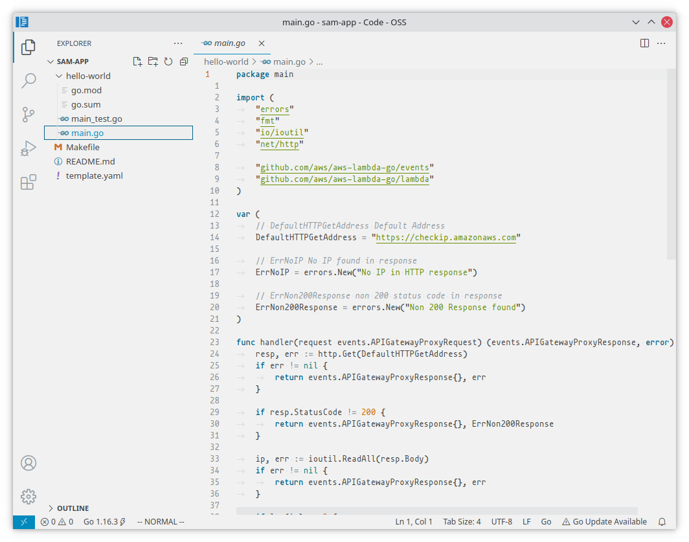
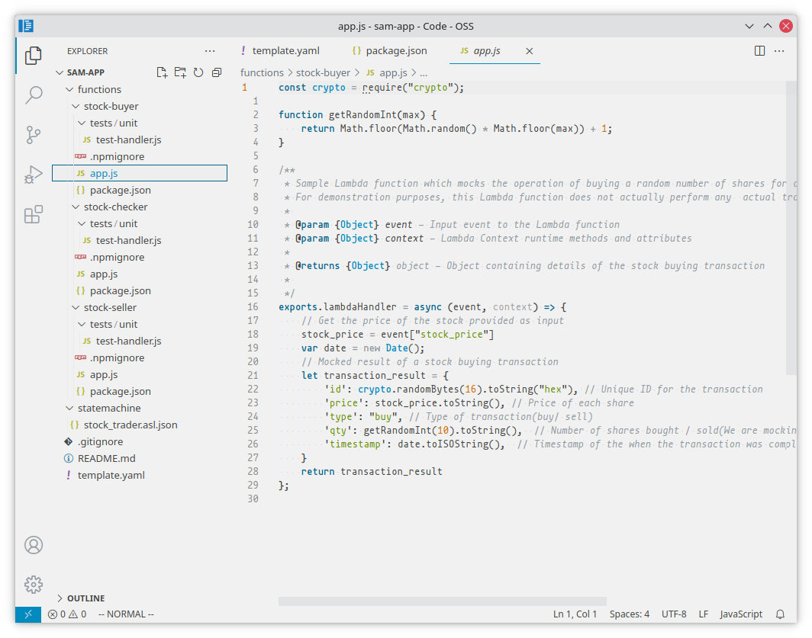
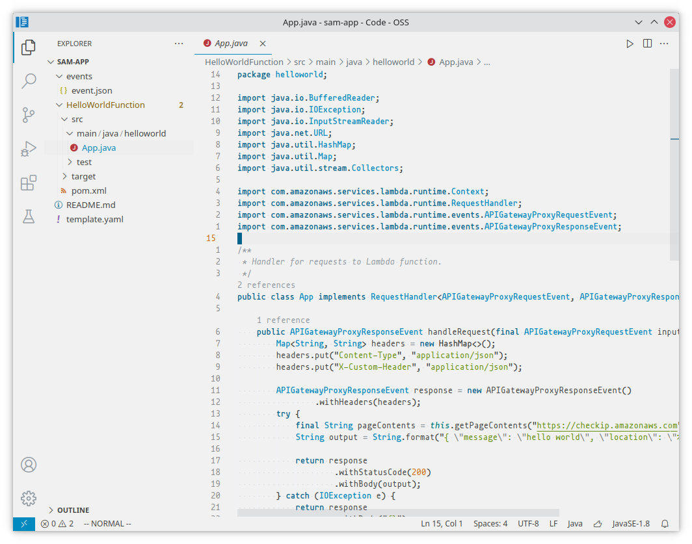
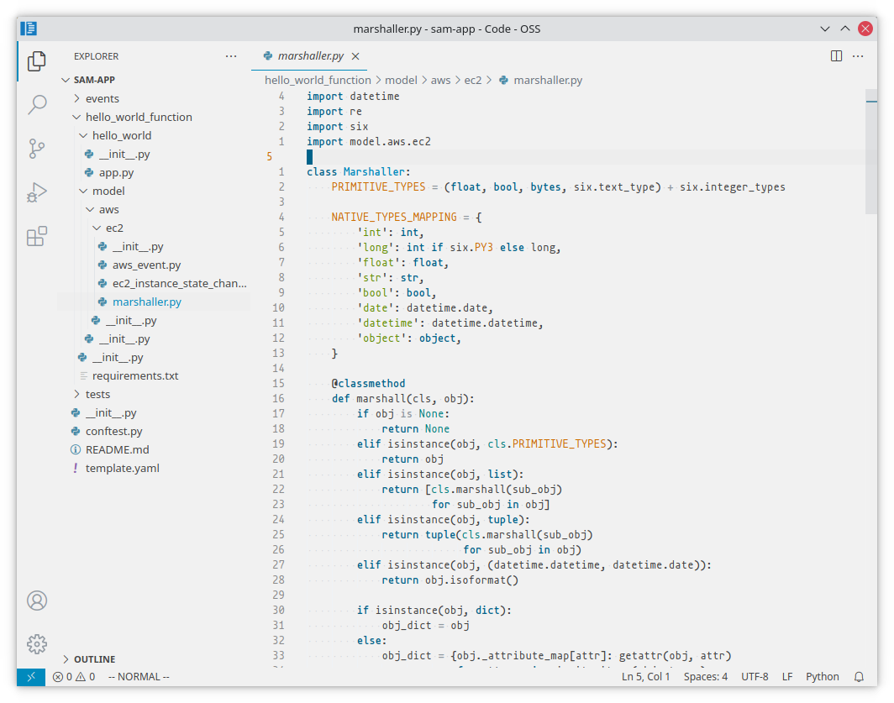
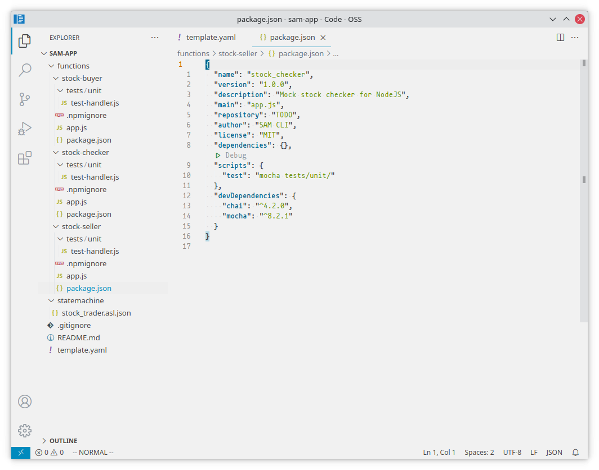
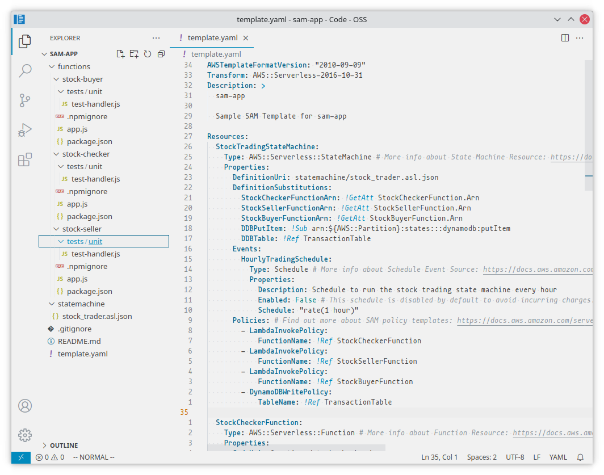
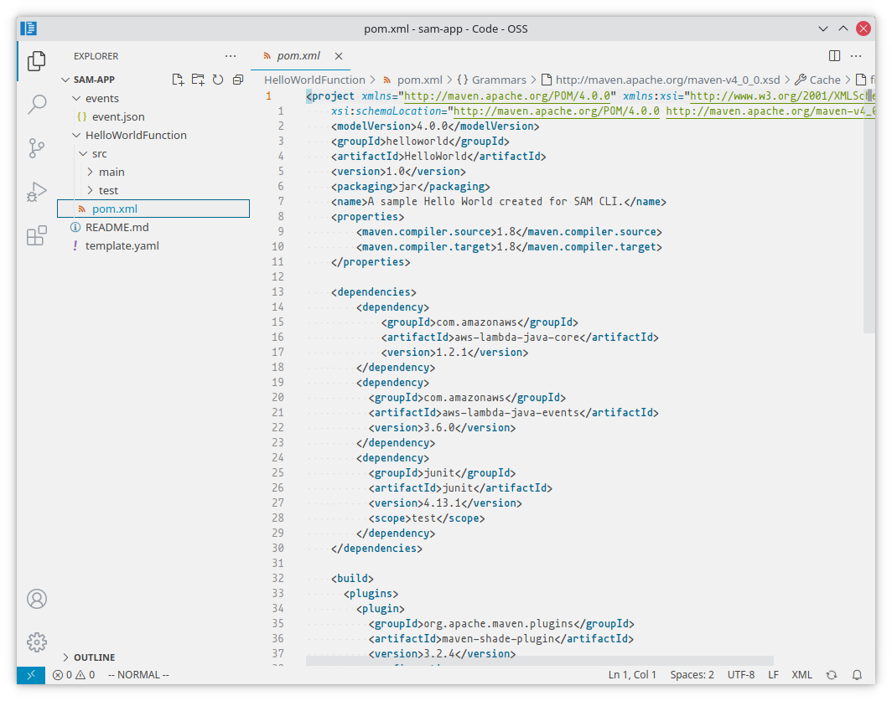

# Cloud

   

Light colored theme for vscode

## Installing

Extension is available in [Visual Studio Code Marketplace](https://marketplace.visualstudio.com/items/vallyscode.cloud-vscode-theme)

**Enjoy!**

## Screenshots

## License

See [LICENSE](LICENSE)
